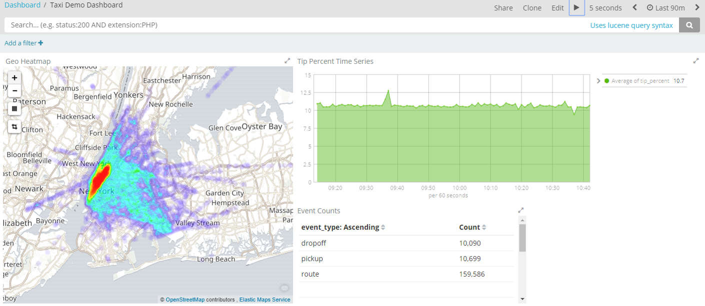
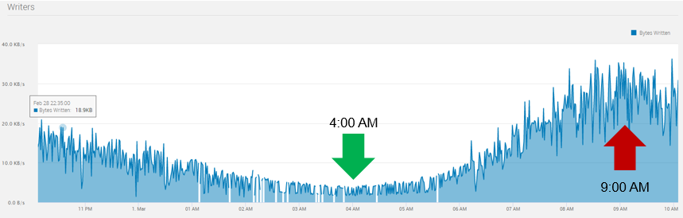
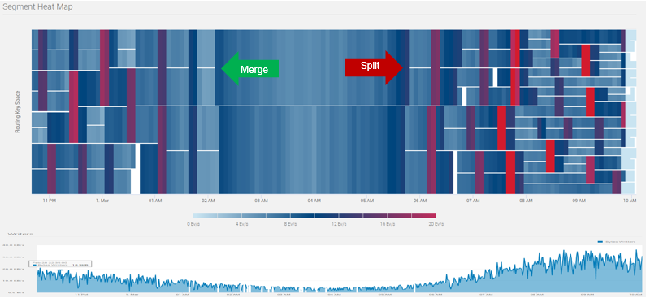

# Taxi Demo - Nautilus Streaming Analytics Demo

## Overview



This projects demonstrates how to use several key features of Nautilus to perform real-time analytics
and visualization on streaming Internet-Of-Things (IOT) data.

## Components

- Pravega: Pravega provides a new storage abstraction - a stream - for continuous and unbounded data. 
  A Pravega stream is a durable, elastic, append-only, unbounded sequence of bytes that has good performance and strong consistency.

  Many real-life data streams have event rates that vary greatly with daily, weekly, and seasonable periods.
  For example, below shows NYC Yellow Taxi event rate.

  

  Pravega provides dynamic scaling that can increase and decrease parallelism to automatically respond
  to changes in the event rate.

  

  See <http://pravega.io> for more information.

- Flink: Apache Flink® is an open-source stream processing framework for distributed, high-performing, always-available, and accurate data streaming applications.
  See <https://flink.apache.org> for more information.
  
- Data Preparation: The [preprocess_data](preprocess_data) directory contains a Python script used to prepare the data that
  the Streaming Data Generator will use.
  This reads the NYC Yellow Taxi trip data and produces a set of JSON files containing events based on the trips.
  Events are written in time order.

- Streaming Data Generator: A streaming data generator has been
  created that can playback data and send it to the REST gateway.
  This is a Python script and is in the [streaming_data_generator](streaming_data_generator) directory.
  
- Gateway: This is a REST web service that receives JSON documents from the Streaming Data Generator.
  It parses the JSON, adds the remote IP address, and then writes it to a Pravega stream.
  This is a Java application and is in the [gateway](gateway) directory.

- Flink Streaming Job: This is a Java application that defines a job that can be executed in the Flink cluster.
  This particular job simply reads the events from Prvega and loads them into Elasticsearch for visualization.
  This is in the [flinkprocessor](flinkprocessor) directory. 
  
- Elasticsearch: This stores the output of the Flink Streaming Job for visualization.

- Kibana: This provides visualization of the data in Elasticsearch.

  

- Docker: This demo uses Docker and Docker Compose to greatly simplify the deployment of the various
  components on Linux and/or Windows servers, desktops, or even laptops.
  For more information, see <https://en.wikipedia.org/wiki/Docker_(software)>.

## Running the Demo

### Install Docker and Docker Compose

See <https://docs.docker.com/install/linux/docker-ce/ubuntu/>
and <https://docs.docker.com/compose/install/>.

### Install Elasticsearch and Kibana

- `cd docker-elk ; docker-compose up -d`

- Open Kibana. 
  <http://localhost:5601/>

- Import Kibana objects from `taxidemo-kibana-export.json`.

### Prepare Data

The following steps will download the NYC Yellow Taxi data and preprocess it so it can
be used by the Streaming Data Generator.

- `mkdir data`

- Visit <http://www.nyc.gov/html/tlc/html/about/trip_record_data.shtml> and download the
  March 2015 Yellow Taxi trip data.
  ```wget -O data/yellow_tripdata_2015-03.csv https://s3.amazonaws.com/nyc-tlc/trip+data/yellow_tripdata_2015-03.csv```

- Build the Docker container.
```
docker build -t taxidemo_preprocess_data preprocess_data 
```

- Execute the preprocess job.
```
docker run --rm -v ${PWD}/data:/data taxidemo_preprocess_data \
spark-submit --master local[8] preprocess_data.py \
--input /data/yellow_tripdata_2015-03.csv --output /data/data.json
```

### Launch Jupyter Notebook (optional)

This is an optional step. It will start open Jupyter notebook that can be used
to interactively preprocess the data. This allows you to customize the events. 
 
- `cd preprocess_data`

- Launch the Jupyter environment in Docker.
  ```docker-compose up -d```
  
- Open your browser to Jupyter.
  <http://localhost:8888/notebooks/work/preprocess_data.ipynb>

- Open the `preprocess_data.ipynb` notebook.

- Execute all cell by clicking Cells -> Run All.
  This may take several minutes to run.
  It will write several files within a directory named data.json.
  These files can be used by the Streaming Data Generator.

### Run Applications

- Build the Gateway.
  ```./gradlew gateway:distTar```

- Build Docker containers.
  ```docker-compose build```

- Start Pravega, Gateway, and Streaming Data Generator.
  ```docker-compose up -d```

### Run Flink Jobs

- The Flink job can be executed with Nautilus, another Flink cluster, or in standalone mode.  
  In standalone mode, a mini Flink cluster will execute within the application process.
  When run in the IntelliJ IDE, standalone mode will be used by default.

- Run the Raw Data job by using the following parameters:
```
--runMode rawdata-to-elasticsearch 
--controller tcp://$PRAVEGA_HOST_ADDRESS:9090 
--input.stream iot/data 
--elastic-sink true 
--elastic-host $ELASTIC_HOST 
--elastic-index taxidemo-rawdata 
--elastic-type event 
--elastic-delete-index true
```

- Run the Extract Statistics job with the following parameters:
```
--runMode extract-statistics
--controller tcp://$PRAVEGA_HOST_ADDRESS:9090 
--input.stream iot/data 
--elastic-sink true 
--elastic-host $ELASTIC_HOST 
--elastic-index taxidemo-stats 
--elastic-type stats 
--elastic-delete-index false
```

## Building the Demo

### Install Operating System

Install Ubuntu 16.04 LTS. Other operating systems can also be used but the commands below have only been tested
on this version.

### Install Java

```
apt-get install default-jdk
```

### Install IntelliJ

Install from <https://www.jetbrains.com/idea>.
Enable the Lombok plugin. 
Enable Annotations (settings -> build, execution, deployment, -> compiler -> annotation processors). 

# References

- <http://pravega.io/>
- <http://pravega.io/docs/latest/deployment/run-local/>
- <https://flink.apache.org>
- <https://cwiki.apache.org/confluence/display/FLINK/Streams+and+Operations+on+Streams>
- <https://jersey.java.net/documentation/latest/getting-started.html>
- <http://www.oracle.com/webfolder/technetwork/tutorials/obe/java/griz_jersey_intro/Grizzly-Jersey-Intro.html>
- <https://github.com/deviantony/docker-elk>
